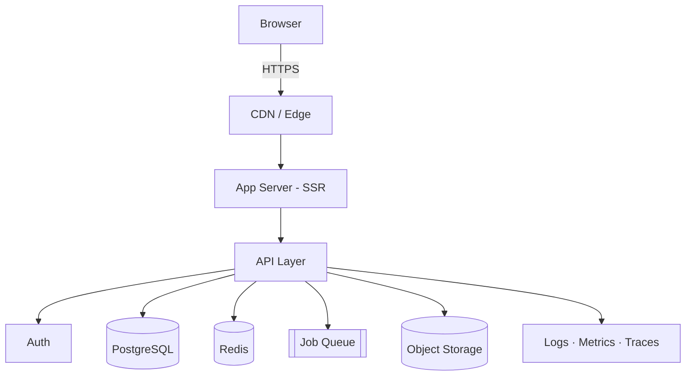
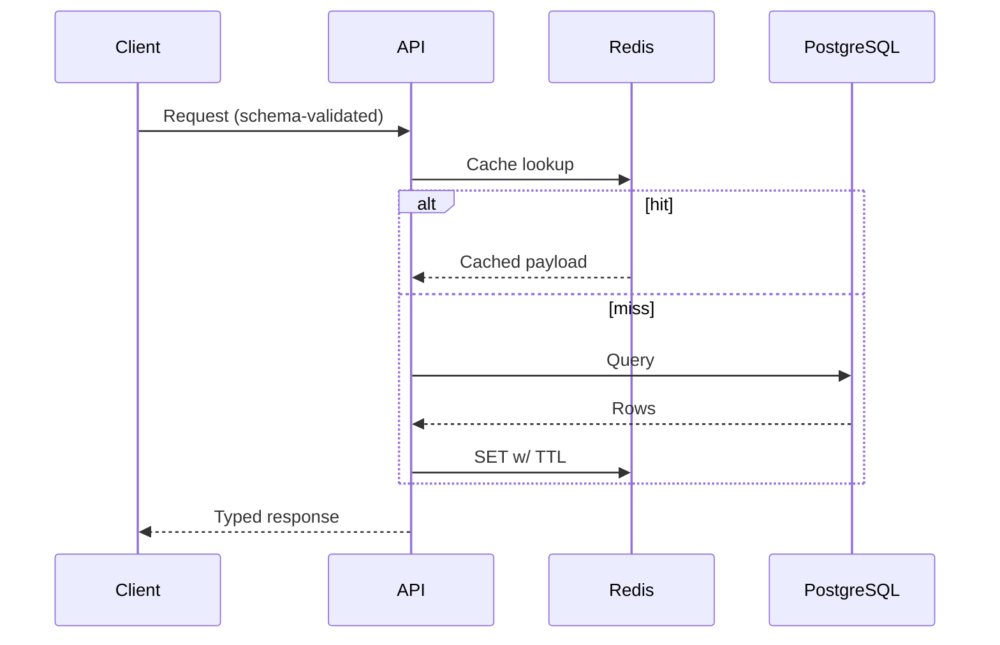
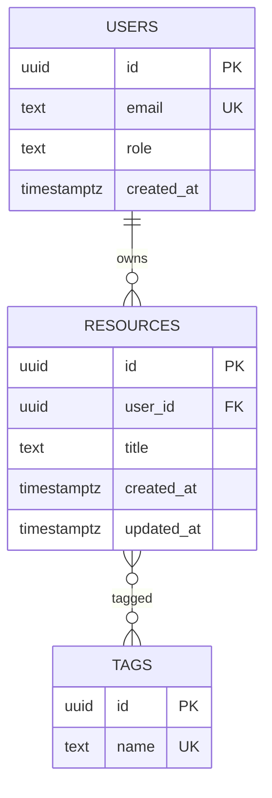
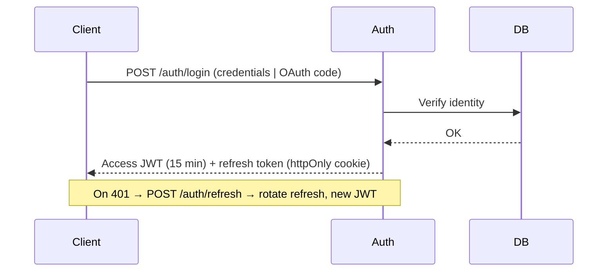

# Project Eris — Engineering Documentation

**Status:** Living document · **Owner:** [team] · **Last updated:** [date]

Documentation-first workflow. For every feature: update the relevant section here → assess architectural impact → identify affected files → state trade-offs → verify assumptions → implement. Bracketed values (`[...]`) are project-specific and must be filled in.

---

## Table of Contents

1. [Project Overview](#1-project-overview)
2. [Requirements](#2-requirements)
3. [Architecture](#3-architecture)
4. [Tech Stack](#4-tech-stack)
5. [Folder Structure](#5-folder-structure)
6. [Database](#6-database)
7. [API](#7-api)
8. [Authentication & Authorization](#8-authentication--authorization)
9. [State Management](#9-state-management)
10. [UI Guidelines](#10-ui-guidelines)
11. [Component Guidelines](#11-component-guidelines)
12. [Coding Standards](#12-coding-standards)
13. [Git Workflow](#13-git-workflow)
14. [Testing](#14-testing)
15. [Performance](#15-performance)
16. [SEO](#16-seo)
17. [Security](#17-security)
18. [Deployment](#18-deployment)
19. [Environment Variables](#19-environment-variables)
20. [Error Handling](#20-error-handling)
21. [Logging](#21-logging)
22. [Monitoring & Observability](#22-monitoring--observability)
23. [Accessibility](#23-accessibility)
24. [Roadmap](#24-roadmap)
25. [Changelog](#25-changelog)
26. [Architecture Decision Records](#26-architecture-decision-records)
27. [TODOs](#27-todos)

---

## 1. Project Overview

- **Vision:** [one sentence — what the system does and for whom]
- **Target users:** [primary persona] · [secondary persona]
- **Business goal:** [measurable outcome]

**Core features**

| # | Feature | Priority |
|---|---|---|
| F1 | [feature] | P0 |
| F2 | [feature] | P1 |

**Success metrics**

| Metric | Target | Source |
|---|---|---|
| [activation / retention / core action] | [target] | [analytics] |

---

## 2. Requirements

### Functional
- **FR-1:** [The system shall …]
- **FR-2:** [The system shall …]

### Non-functional

| Category | Requirement |
|---|---|
| Performance | p95 API latency < 300 ms; LCP < 2.5 s |
| Availability | 99.9% uptime |
| Scalability | [N] concurrent users |
| Security | TLS in transit; AES-256 at rest; OWASP Top 10 mitigated |
| Accessibility | WCAG 2.2 AA |

### Edge cases
Empty/zero states · concurrent writes · network partitions and timeouts · oversized inputs · rate-limit boundaries.

### Constraints & assumptions
- Constraints: [compliance, browser matrix, timeline]
- Assumptions: [list — verify before build]
- Dependencies: [third-party APIs, internal services]

### Acceptance criteria
Every feature ships with Given/When/Then criteria and automated tests covering them.

---

## 3. Architecture

Modular monolith, stateless application tier, relational core, async job queue. Service extraction deferred until scale requires it (see ADR).

### System diagram



### Request flow



### Layering
`route → service → repository → database`. Business logic lives in services only. Validation at the boundary. Typed contracts end-to-end.

### Rendering strategy

| Route class | Strategy | Rationale |
|---|---|---|
| Marketing / docs | SSG / ISR | CDN-cacheable, SEO |
| Authenticated app | SSR + client cache | fresh data, fast TTFB |
| Highly interactive views | CSR islands | avoid server round-trips |

### Caching

| Layer | Content | TTL | Invalidation |
|---|---|---|---|
| CDN | Static assets, ISR pages | long | deploy / on-demand revalidate |
| Redis | Hot queries, sessions, rate counters | short | write-through on mutation |
| Client | Server state (query cache) | per-query | mutation-driven |

### Scalability
Horizontal scale of stateless app tier → Redis for shared state → read replicas + covering indexes → queue for async work. Shard only after replicas and caching are exhausted.

---

## 4. Tech Stack

| Concern | Choice | Rationale | Alternatives |
|---|---|---|---|
| Frontend | Next.js (App Router), TypeScript strict | SSR/ISR + type safety, single framework | Remix, SvelteKit |
| Styling | Tailwind CSS + design tokens | consistency, minimal CSS output | CSS Modules |
| API | Route handlers (REST, `/api/v1`) | colocated, typed; extractable later | NestJS, Go |
| Database | PostgreSQL | ACID, relational integrity, JSONB | MySQL |
| ORM | Prisma / Drizzle | type-safe queries, versioned migrations | Kysely |
| Auth | Auth.js (JWT + rotating refresh) | secure defaults, OAuth built-in | Clerk, Auth0 |
| Cache / queue | Redis (+ BullMQ) | sessions, rate limits, jobs | SQS |
| Storage | S3-compatible | blobs off the DB | GCS |
| CI/CD | GitHub Actions | native to repo | GitLab CI |
| Hosting | Vercel / containers | preview deploys, edge network | Fly.io, AWS |
| Observability | Sentry + OpenTelemetry | errors, traces, release tagging | Datadog |
| Testing | Vitest, Testing Library, Playwright | unit → E2E coverage | Jest, Cypress |

Stack changes require an ADR (§26).

---

## 5. Folder Structure

```
src/
├─ app/            # Routes: pages, layouts, route handlers
├─ components/
│  ├─ ui/          # Primitives (Button, Input, Dialog)
│  └─ features/    # Feature-scoped composites
├─ features/       # Feature modules: hooks + services + types
├─ server/         # services/, repositories/, db/
├─ lib/            # Framework-agnostic utilities, API clients
├─ hooks/          # Shared React hooks
├─ stores/         # Client-state stores
├─ types/          # Shared TS types
├─ styles/         # Tokens, globals
└─ config/         # Runtime config, env parsing
tests/             # Integration + E2E
scripts/           # Dev/ops tooling
docs/              # This document
```

**Conventions**
- Files/folders `kebab-case`; components `PascalCase`; functions/vars `camelCase`; constants/env `SCREAMING_SNAKE_CASE`.
- Strict separation: components never access the database; data access only via repositories; business logic only in services.
- New feature → `src/features/<name>/` + route in `src/app/`. Shared primitive → `src/components/ui/`. Pure helper → `src/lib/`.

---

## 6. Database

### Schema

| Entity | Key columns | Notes |
|---|---|---|
| `users` | `id uuid PK`, `email unique`, `role`, `created_at` | auth subject |
| `[resources]` | `id uuid PK`, `user_id FK`, `title`, timestamps | owned aggregate |
| `[resource_tags]` | `resource_id FK`, `tag_id FK` | M:N join |



### Indexing
- FK indexes on all foreign keys; unique index on `users.email`.
- Composite indexes matched to hot paths, e.g. `(user_id, created_at DESC)` for owner-scoped listing.
- Partial indexes for frequent filtered queries (e.g. `WHERE status = 'active'`).

### Normalization
3NF by default. Denormalization only for measured read-path bottlenecks, recorded as an ADR.

### Migrations
- Versioned, forward-only, committed to git; applied migrations are immutable.
- Zero-downtime via **expand → backfill → contract**; every step backward-compatible with the running release.
- Destructive changes (drop/rename) only in the contract phase after code no longer references the column.

---

## 7. API

REST, JSON, versioned under `/api/v1`. Schema validation (Zod) at every boundary; unknown fields rejected.

### Resource endpoints

| Method | Path | Action | Success |
|---|---|---|---|
| GET | `/api/v1/resources` | List (paginated) | 200 |
| POST | `/api/v1/resources` | Create | 201 |
| GET | `/api/v1/resources/{id}` | Read | 200 |
| PATCH | `/api/v1/resources/{id}` | Partial update | 200 |
| DELETE | `/api/v1/resources/{id}` | Delete | 204 |

**Request — `POST /api/v1/resources`**
```json
{ "title": "string (1..120)", "tags": ["string"] }
```

**Response — `201`**
```json
{ "data": { "id": "uuid", "title": "string", "createdAt": "ISO-8601" } }
```

**Error envelope (all non-2xx)**
```json
{
  "error": {
    "code": "VALIDATION_ERROR",
    "message": "title is required",
    "details": [{ "field": "title", "issue": "required" }],
    "requestId": "req_abc123"
  }
}
```

### Conventions
- **Status codes:** 200/201/204 success · 400 malformed · 401 unauthenticated · 403 unauthorized · 404 not found · 409 conflict · 422 semantic validation · 429 rate-limited · 500 internal.
- **Pagination:** cursor-based — `?limit=20&cursor=<opaque>`; responses include `nextCursor`.
- **Filtering / sorting:** allow-listed fields only — `?status=active&sort=-createdAt`.
- **Idempotency:** `Idempotency-Key` header on unsafe retried operations.
- Mutations return the mutated resource; timestamps are UTC ISO-8601; IDs are opaque UUIDs.

---

## 8. Authentication & Authorization



- **Access token:** JWT, ~15 min TTL, claims `sub`, `role`, `exp`; signed with `AUTH_SECRET`.
- **Refresh token:** httpOnly + Secure + SameSite=Lax cookie; rotated on every use; server-side revocation list enables logout-everywhere.
- **OAuth:** provider identities mapped to internal `users` rows on first login.
- **RBAC:** `admin` / `member` / `viewer` → permission sets. Enforced **server-side in the service layer on every request**; UI gating is UX only, never a security control.
- **Route protection:** middleware asserts a valid session before any protected handler runs.
- **Credential storage:** argon2id password hashing; no plaintext secrets anywhere.

---

## 9. State Management

| State | Examples | Mechanism |
|---|---|---|
| Server state | fetched entities, lists | Query cache (TanStack Query / RSC fetch) |
| URL state | filters, tabs, pagination | search params — shareable, restorable |
| Global client state | theme, session flags | minimal store (Zustand) |
| Local state | form inputs, toggles | `useState` / `useReducer`, colocated |

**Rules**
- Server data is fetched on the server for first paint, hydrated into the client query cache for interactivity.
- Mutations invalidate affected query keys — no manual cache surgery.
- Server state is never duplicated into a global store; the query cache is the single source of truth.
- Global store holds only cross-cutting UI state; everything else stays local.

---

## 10. UI Guidelines

- **Spacing:** 4/8 px scale via tokens; no magic numbers.
- **Typography:** fixed type scale; 60–75 ch line length; two weights max per view.
- **Color:** semantic tokens only (`--color-primary`, `--color-danger`); raw hex prohibited in components; contrast per §23.
- **Responsive:** mobile-first; verified at 320 / 768 / 1024 / 1440 px.
- **Dark mode:** token-driven; both themes tested before merge.
- **Motion:** ≤ 250 ms, easing-standard; honors `prefers-reduced-motion`.
- **Loading:** skeletons for content, inline spinners for actions; no blank screens.
- **Empty states:** explain + provide the next action.
- **Error states:** human-readable message + retry path; no raw error dumps.

---

## 11. Component Guidelines

- Atomic layering: primitives (`ui/`) → composites (`features/`) → views (`app/`).
- Props: typed, minimal, explicit defaults. Composition (`children`, slots) over boolean-prop variants.
- Presentational components never fetch; data enters via props or feature hooks.
- One component per file; filename = component name.

```tsx
// ✅ Single-purpose, typed, composable
function Card({ title, children }: { title: string; children: React.ReactNode }) {
  return (
    <section className="card">
      <h3>{title}</h3>
      {children}
    </section>
  );
}

// ❌ Kitchen-sink props, data fetching inside presentation
function Card({ title, variant, isBig, hasBorder, fetchUrl }) { /* … */ }
```

---

## 12. Coding Standards

- **Tooling-enforced:** Prettier + ESLint + `tsc --noEmit` in CI; violations fail the build. TypeScript `strict: true`; `any` requires justification.
- **Functions:** single responsibility; ≤ 3 positional params (object beyond that); pure where possible.
- **Hooks:** `use` prefix; encapsulate side effects; extract shared logic into custom hooks.
- **Imports:** ordered external → internal → relative; path aliases (`@/…`); no unused imports.
- **Comments:** explain *why*, not *what*; dead code is deleted, not commented out.
- **Principles:** SOLID · DRY · KISS · YAGNI. Abstraction requires three concrete usages (rule of three).

---

## 13. Git Workflow

- **Branching:** trunk-based; short-lived `feat/*`, `fix/*`, `chore/*` off `main`; no long-running branches.
- **Commits:** Conventional Commits — `feat:`, `fix:`, `docs:`, `refactor:`, `test:`, `chore:`.
- **PR gate:** docs updated · tests added and green · lint/typecheck pass · no secrets · scoped diff.
- **Review:** correctness → security → tests → readability → performance. One approval minimum.
- **Release:** merge to `main` → CI → staging → verify → promote to production (tagged, changelog entry).
- **Hotfix:** `hotfix/*` from prod tag → fix → fast-track review → deploy → back-merge to `main`.

---

## 14. Testing

| Layer | Scope | Tooling | Volume |
|---|---|---|---|
| Unit | pure logic, components | Vitest + Testing Library | many, fast |
| Integration | services + DB, API routes | Vitest + ephemeral Postgres | key flows |
| E2E | critical user journeys | Playwright | few, stable |

- **Coverage:** ~80% on core logic; 100% on auth and data-integrity paths. Coverage is a signal, not a goal.
- Test behavior, not implementation. Deterministic runs — fake timers, mocked network, seeded data.
- CI blocks merge on any failing layer.

---

## 15. Performance

**Budget (CI-enforced):** LCP < 2.5 s · INP < 200 ms · CLS < 0.1 · initial JS < [150] KB gzip · p95 API < 300 ms.

- Route-level code splitting; `dynamic()` imports for heavy modules.
- Images: AVIF/WebP, responsive `sizes`, lazy-loaded, explicit dimensions.
- Fonts: subset + `font-display: swap`; self-hosted.
- N+1 queries prohibited — verified in review; hot paths covered by indexes (§6).
- Bundle analysis on every release; dependency additions require size justification.

---

## 16. SEO

- Unique `<title>` + meta description per route; Open Graph + Twitter card tags.
- JSON-LD structured data (`Organization`, `Article`, `BreadcrumbList`) where applicable.
- Generated `sitemap.xml` + `robots.txt`; `noindex` on private/auth routes.
- Canonical URL per resource; no duplicate-content routes.
- SSR/SSG for all crawlable content — no client-only rendering of indexable pages.

---

## 17. Security

- **Validation:** all input schema-validated at the boundary; allow-list semantics; unknown fields rejected.
- **Injection:** parameterized queries only (ORM); no string-built SQL.
- **XSS:** framework escaping; `dangerouslySetInnerHTML` prohibited without sanitization; strict CSP.
- **CSRF:** SameSite cookies + anti-CSRF tokens on state-changing requests.
- **AuthZ:** deny-by-default, enforced in the service layer (§8).
- **Rate limiting:** Redis-backed, per-IP and per-user on auth and expensive endpoints.
- **Secrets:** never in git; injected via environment/secrets manager; rotated on schedule (§19).
- **Headers:** `Strict-Transport-Security`, `Content-Security-Policy`, `X-Content-Type-Options: nosniff`, `Referrer-Policy`, `X-Frame-Options: DENY`.
- **Process:** OWASP Top 10 review + dependency audit (`npm audit`, Dependabot) every release.

---

## 18. Deployment

**Pipeline:** `install → typecheck → lint → unit → integration → build → E2E (preview) → deploy`. Any failure halts the pipeline.

| Environment | Trigger | Purpose |
|---|---|---|
| Preview | every PR | isolated review deploy |
| Staging | merge to `main` | pre-production verification |
| Production | manual promotion | tagged, immutable release |

- Immutable artifacts — promote, never rebuild.
- **Rollback:** one-click revert to previous release; DB migrations always backward-compatible with release N-1 (§6).
- **Launch gate:** migrations applied · env vars verified · alerts live · backups tested · rollback rehearsed.

---

## 19. Environment Variables

| Variable | Purpose | Secret |
|---|---|---|
| `DATABASE_URL` | Postgres connection | ✅ |
| `REDIS_URL` | cache / queue / rate limits | ✅ |
| `AUTH_SECRET` | JWT signing (32+ random bytes) | ✅ |
| `S3_BUCKET` / `S3_CREDENTIALS` | object storage | ✅ |
| `SENTRY_DSN` | error reporting | ⚠️ |
| `NEXT_PUBLIC_APP_URL` | public base URL | ❌ |

- `.env.example` committed with placeholder values; real values never in git.
- Env parsed and validated at boot (Zod) — missing/invalid config fails fast at startup, not at request time.
- `NEXT_PUBLIC_*` is browser-exposed; secrets are never prefixed with it.

---

## 20. Error Handling

- **Backend:** typed error hierarchy (`AppError → NotFoundError | ValidationError | AuthError`); central handler maps to the §7 envelope + correct status. Stack traces never reach clients.
- **Frontend:** error boundaries per route segment; fallback UI with retry; errors reported to Sentry with `requestId` correlation.
- **Retries:** idempotent operations only — exponential backoff + jitter, capped attempts; circuit breaker on failing dependencies.
- **Degradation:** serve cached/partial data over a full-page failure where safe.

---

## 21. Logging

- Structured JSON: `timestamp`, `level`, `message`, `requestId`, `traceId`, `userId` (id only, never PII), `route`, `durationMs`.
- Levels: `error` (actionable) · `warn` (degraded) · `info` (state changes) · `debug` (dev only). Level set per environment.
- **Audit log:** append-only record of security-sensitive events (login, role change, deletion) — actor, action, target, timestamp.
- No PII, credentials, or tokens in any log line. Retention: [30/90] days per compliance requirements.

---

## 22. Monitoring & Observability

- **Metrics:** RED (rate, errors, duration) per endpoint + infra saturation + business KPIs.
- **Tracing:** OpenTelemetry spans across web → API → DB; `traceId` propagated end-to-end and attached to logs.
- **Health:** `/health` (liveness) and `/ready` (readiness incl. DB/Redis connectivity) probed by the platform.
- **Alerting:** SLO-based (error rate, p95 latency, availability) → on-call; every alert is actionable, tuned against noise.
- **Crash reporting:** Sentry with source maps and release tagging; regressions traceable to a deploy.

---

## 23. Accessibility

Target: **WCAG 2.2 AA** — enforced via axe in CI + manual audit per release.

- Semantic HTML first; ARIA only where semantics fall short.
- Full keyboard operability: visible focus, logical tab order, no traps; skip-to-content link.
- Contrast ≥ 4.5:1 (text), ≥ 3:1 (large text/UI) — verified in both themes.
- Screen readers: labeled controls, alt text, `aria-live` for async updates; tested with VoiceOver/NVDA.
- Forms: programmatically associated labels and error messages.

---

## 24. Roadmap

| Stage | Scope | Exit criteria |
|---|---|---|
| MVP | [smallest end-to-end core loop] | [criteria] |
| V1 | [auth hardening, key features, observability] | [criteria] |
| V2 | [scale work, integrations] | [criteria] |
| Future | [deferred items] | — |

---

## 25. Changelog

Format: [Keep a Changelog](https://keepachangelog.com) · [SemVer](https://semver.org).

### [Unreleased]

### [0.1.0] — [date]
- Added: engineering documentation baseline.

---

## 26. Architecture Decision Records

Append-only. One record per significant decision. Superseded ADRs are marked, never deleted.

```
### ADR-NNN: <title>
Status: Proposed | Accepted | Superseded by ADR-MMM
Date: <date>
Context: <forces and problem>
Decision: <what was chosen>
Consequences: <trade-offs accepted>
Alternatives: <options rejected, and why>
```

### ADR-001: [e.g. Modular monolith over microservices]
- **Status:** Accepted · **Date:** [date]
- **Context:** [team size, unknown scale, iteration speed]
- **Decision:** [single deployable, enforced internal module boundaries]
- **Consequences:** [simpler ops; future extraction cost accepted]
- **Alternatives:** [microservices — rejected: operational overhead unjustified at current scale]

---

## 27. TODOs

### Now
- [ ] Fill §1 with product specifics; confirm success metrics.
- [ ] Ratify tech stack as ADR-001.
- [ ] Define initial schema (§6) and first endpoints (§7).

### Next
- [ ] CI pipeline: typecheck, lint, tests, preview deploys (§18).
- [ ] Auth flow + RBAC roles (§8).
- [ ] Error envelope + logging middleware (§20–21).

### Later
- [ ] Performance budgets in CI (§15).
- [ ] Accessibility audit (§23).
- [ ] Dashboards + SLO alerts (§22).
